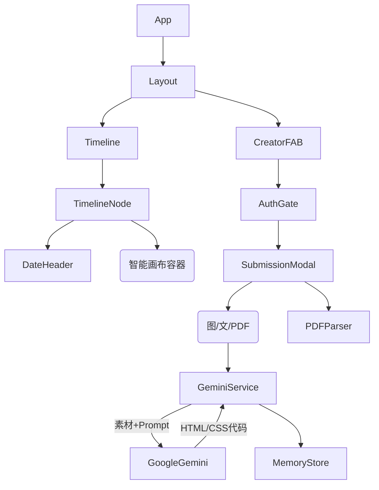

# 技术架构文档 (Architecture)

## 1. 技术栈 (Tech Stack)

*   **Runtime**: React 18+ (TypeScript)
*   **UI Framework**: Tailwind CSS
*   **AI Engine**: Google GenAI SDK (`@google/genai`)
    *   **Model**: `gemini-2.5-flash-image` (用于处理多模态输入并生成代码)
*   **PDF Processing**: `pdf.js` (用于前端提取 PDF 文本)
*   **HTML Rendering**: `html-react-parser` 或 `dangerouslySetInnerHTML` (配合 DOMPurify 进行清洗)
*   **Storage**: LocalStorage (Prototype) / Firebase or Supabase (Production recommended for file hosting)

## 2. 系统组件架构



## 3. 核心数据流

1.  **数据模型 (MemoryItem)**:
    ```typescript
    interface MemoryItem {
      id: string;
      date: string; // ISO String
      dayIndex: number; // 第几天
      
      // 原始素材（用于再次编辑或重新生成）
      rawAssets: {
        text?: string;
        images?: string[]; // Data URLs or Remote URLs
        video?: string;
        pdfText?: string;
      };
      
      // AI 生成的成果
      generatedHtml: string; // 完整的 HTML 片段，包含内联样式
      
      // 元数据
      theme?: string; // e.g., "dark", "romantic"
    }
    ```

2.  **AI 生成流程 (The "Designer" Agent)**:
    *   **Input**: 
        *   System Instruction: "你是一个顶尖的前端设计师。用户会给你图片 URL 和文字。请你在一个宽高比为 3:4 (或自适应宽度) 的容器内，写一段 HTML+CSS 代码来展示这些内容。要求设计感强，风格温馨。只返回 HTML 代码，不要 Markdown 标记。"
        *   User Content: 文本内容 + 图片附件。
    *   **Process**: Gemini `generateContent`。
    *   **Output**: 纯 HTML 字符串。
    *   **Render**: 前端将返回的 HTML 注入到 Timeline 卡片的容器中。

## 4. 关键技术难点
*   **样式隔离**: AI 生成的 CSS 类名可能会污染全局样式。
    *   *解决方案*: 要求 AI 使用内联样式 (Inline Styles) 或者使用 CSS Modules 的命名约定，或者利用 Shadow DOM 隔离。
*   **PDF 解析**: 需要在浏览器端将 PDF 转为文本，以便 AI 理解内容。
*   **图片引用**: 
    *   如果使用 Base64，HTML 字符串会非常大。
    *   建议架构：先上传图片拿到 URL，再把 URL 给 AI 写入 `img src`。

## 5. 目录结构策略
核心在于 `SmartCanvas` 组件，它是一个通用的渲染器，负责安全地展示 AI 生成的代码。
